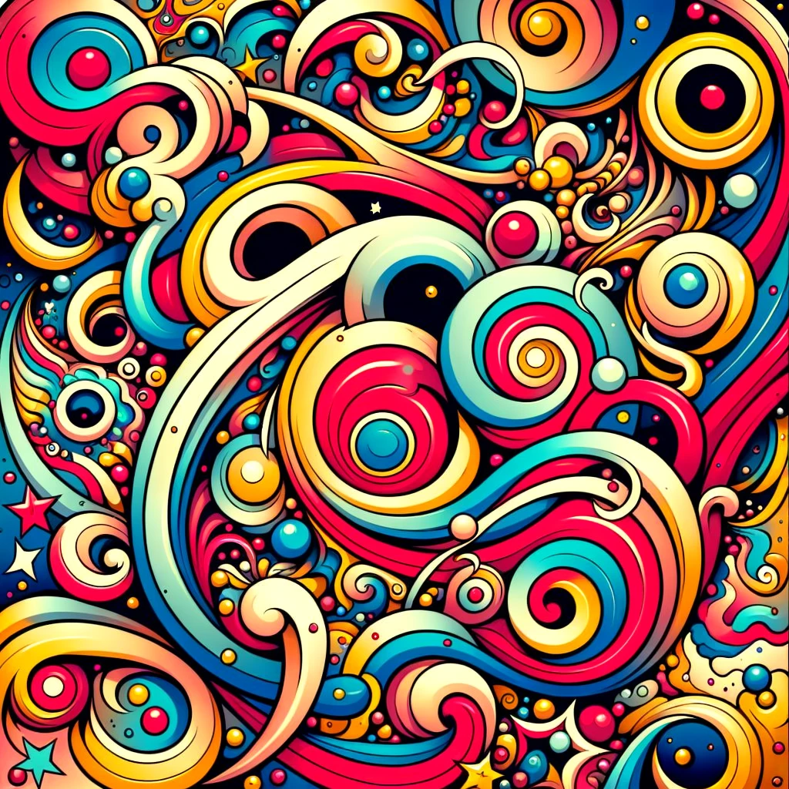

# Fractpunk Fractal Generator

This project generates a visually captivating fractal image, infused with a touch of "Fractpunk" aesthetic: a blend of chaotic beauty, random elements, and whimsical text.

## How it works

1. **Mandelbrot Set:** The core of the image is a classic Mandelbrot fractal, rendered with a color palette inspired by vibrant, almost psychedelic hues.
2. **Random Perturbation:** A small, random perturbation is added to each point in the Mandelbrot calculation, adding an unexpected, "punk" element to the image.
3. **GPT-4 Integration:** The generator fetches a short, whimsical phrase from the GPT-4 API, adding an element of surprise and whimsy to the image.
4. **Random Flare:** A series of random shapes and text annotations are overlaid on the fractal, creating a visual cacophony that complements the underlying fractal structure.

## Usage

**Prerequisites:**

* An OpenAI API key (obtain one at [https://platform.openai.com/](https://platform.openai.com/)).

**Instructions:**

1. Replace `"YOUR_OPENAI_API_KEY"` in the `getGPT4Text` function with your actual API key.
2. Run the program: `go run main.go`
3. The generated image will be saved as `fractpunk_fractal.png`.

**Customization:**

* You can tweak the `colorPalette` to modify the fractal's colors.
* The `addFlare` function offers options for adjusting the number and types of random elements added.
* The `getGPT4Text` function can be modified to generate different types of text from GPT-4 by adjusting the `messages` field in the request body.

## Features

* Generates unique, visually captivating fractal images.
* Integrates with OpenAI's GPT-4 API for whimsical text generation.
* Offers a customizable "Fractpunk" aesthetic.
* Provides a basic framework for incorporating additional creative elements.

### Future Enhancements

* Implement more advanced text drawing capabilities.
* Allow user input for customization of colors, shapes, and text.
* Explore other types of fractals beyond the Mandelbrot set.
* Create a web interface for easier access and customization.

## License

This project is licensed under the MIT License.

## Author

Thomas F McGeehan V
